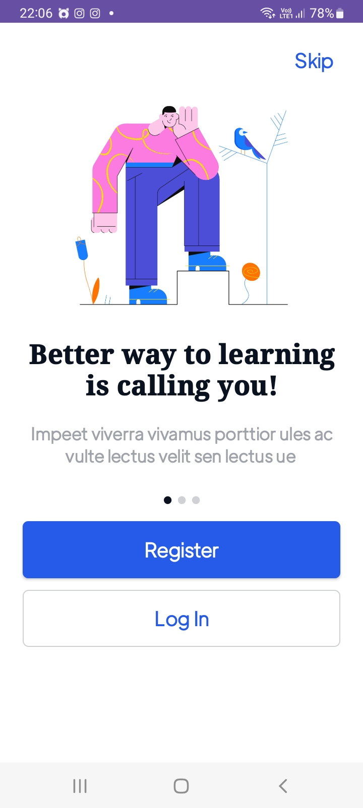
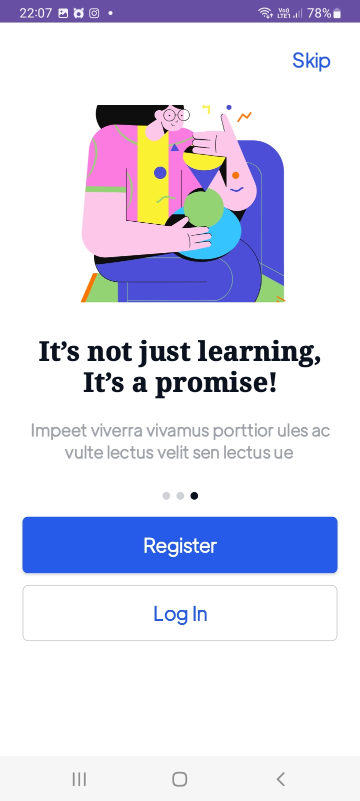
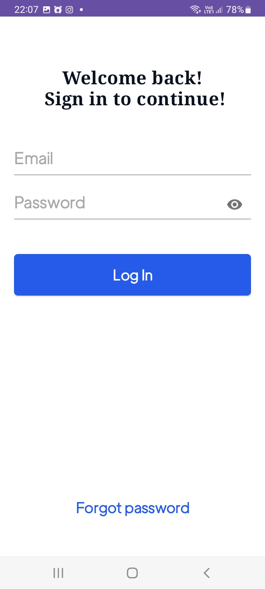
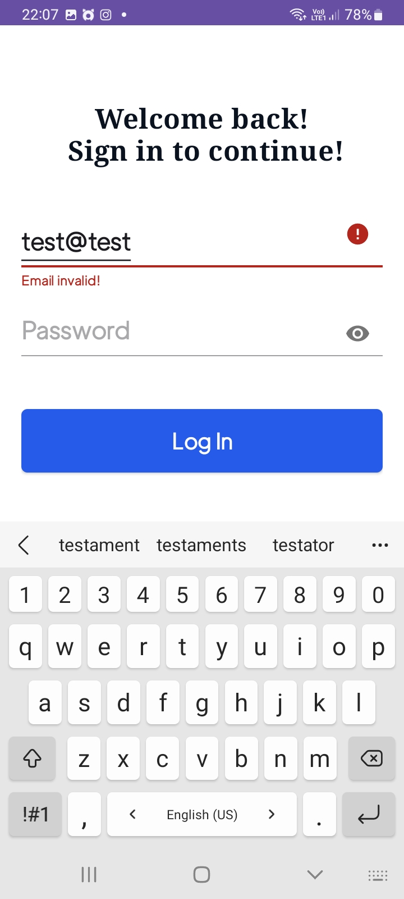
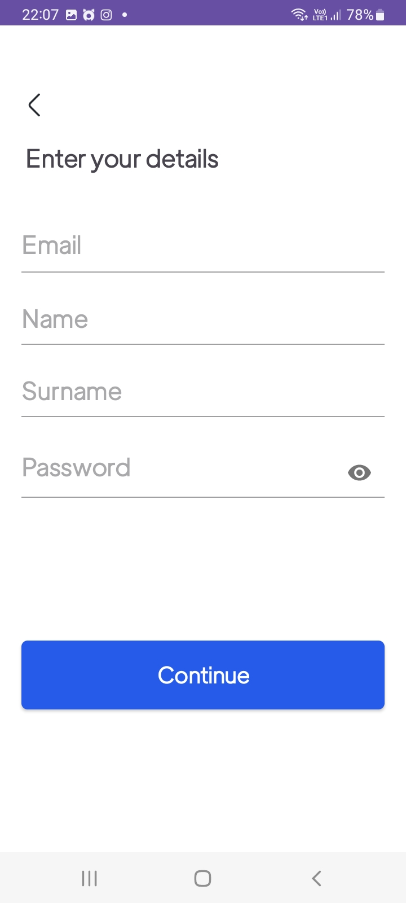
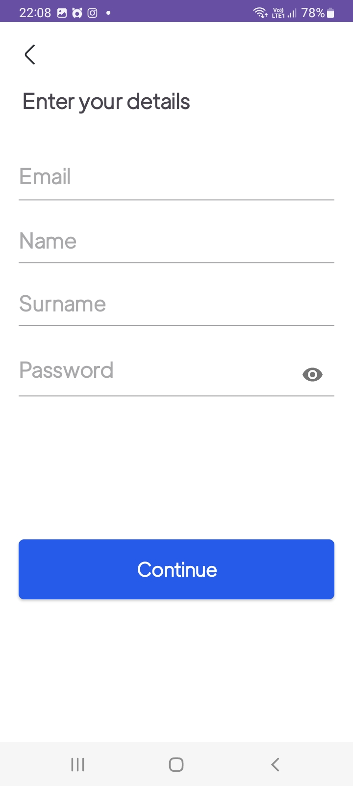
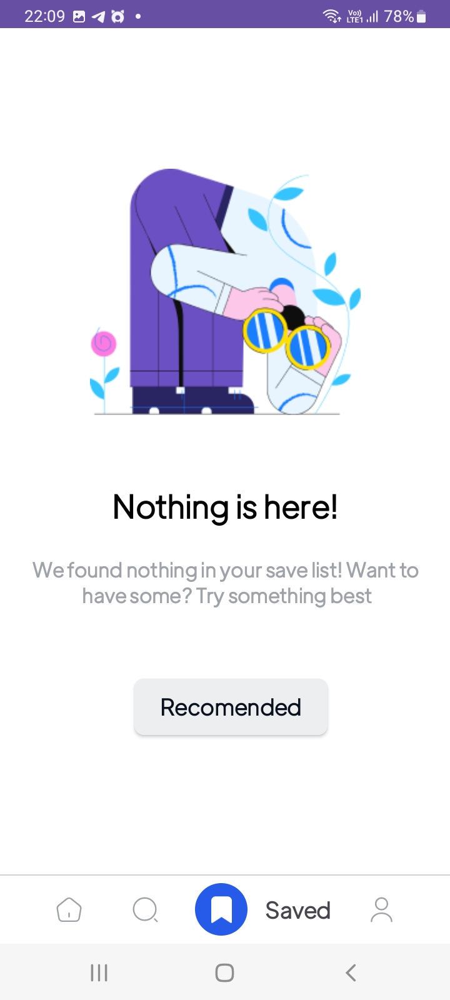
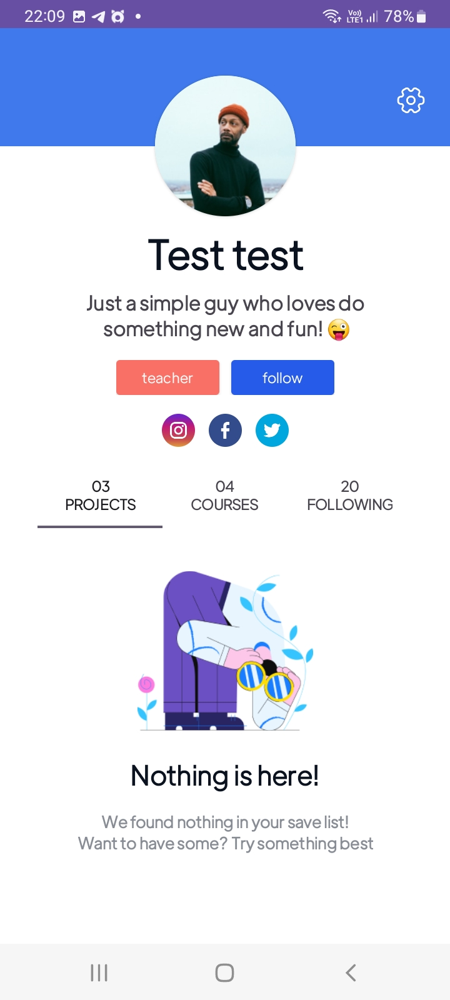
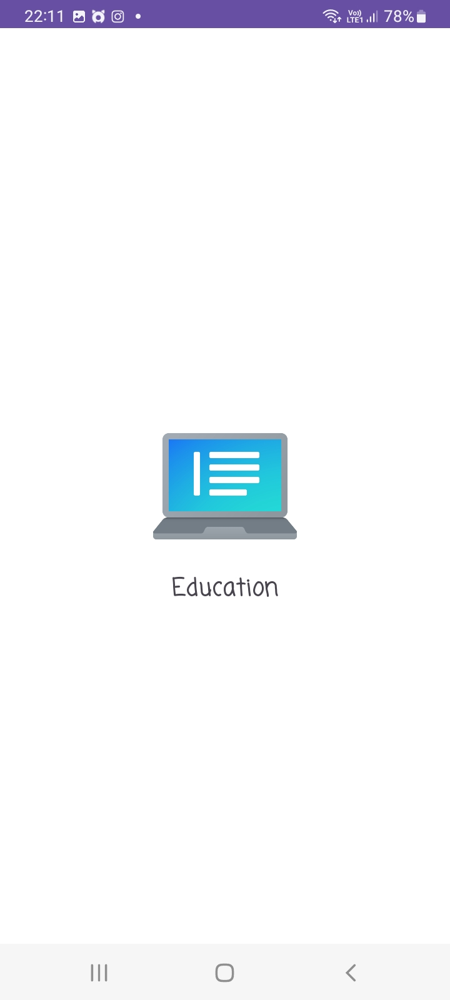
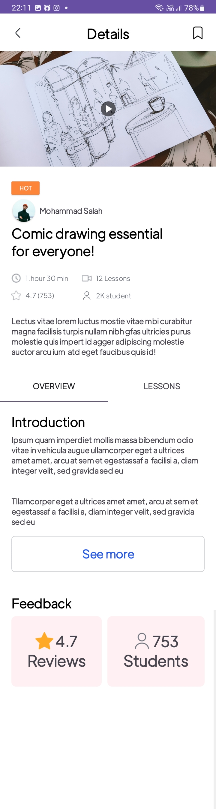

# REST API SERVICE FOR ONLINE EDUCATION

Education is an advanced online school e-learning project that offers a comprehensive learning experience to students through its main REST API service. This service, also known as the Education API, forms the backbone of the platform, providing a wide array of functionalities and resources to facilitate effective online education.

The Education API serves as the primary communication channel between the frontend user interfaces and the backend systems of the e-learning platform. It follows the principles of Representational State Transfer (REST), providing a standardized and scalable approach to data exchange.

One of the key features of the Education API is its ability to manage user information. It allows administrators to create and manage student and teacher accounts, storing relevant details such as names, contact information, and educational backgrounds securely in a database. This information can be accessed and updated through the API, ensuring that user data remains accurate and up-to-date.

The Education API also facilitates course management within the platform. It allows administrators and teachers to create, update, and delete courses, along with their associated materials, assignments, and assessments. Students can enroll in courses, access course content, and submit assignments through the API, ensuring a seamless learning experience.

Additionally, the Education API provides functionality for generating and managing assessments and quizzes. Teachers can create and publish assessments, defining the questions and grading criteria. Students can access these assessments, submit their answers, and receive instant feedback, all through the API.

Furthermore, the Education API supports real-time communication and collaboration features. It allows for the creation and management of discussion forums, enabling students and teachers to engage in meaningful conversations and share knowledge. It also facilitates live chat sessions and video conferencing capabilities, promoting interactive learning experiences.

To enhance the platform's usability, the Education API integrates with various external services and tools. It enables seamless integration with popular learning management systems, content delivery networks, and analytics platforms, allowing for a more comprehensive and personalized learning experience.

Overall, the Education API forms the core of the online school e-learning project, providing the necessary tools and resources for effective education delivery. Its robust and scalable architecture, coupled with its extensive range of features, ensures a seamless and engaging learning experience for students and teachers alike.

### Reference Documentation

For further reference, please consider the following sections:

* [Official Apache Maven documentation](https://maven.apache.org/guides/index.html)
* [Spring Boot Maven Plugin Reference Guide](https://docs.spring.io/spring-boot/docs/3.1.2/maven-plugin/reference/html/)
* [Create an OCI image](https://docs.spring.io/spring-boot/docs/3.1.2/maven-plugin/reference/html/#build-image)
* [Spring for Apache Kafka](https://docs.spring.io/spring-boot/docs/3.1.2/reference/htmlsingle/#messaging.kafka)
* [Spring Boot DevTools](https://docs.spring.io/spring-boot/docs/3.1.2/reference/htmlsingle/#using.devtools)
* [Spring Data JPA](https://docs.spring.io/spring-boot/docs/3.1.2/reference/htmlsingle/#data.sql.jpa-and-spring-data)
* [Spring Data Redis (Access+Driver)](https://docs.spring.io/spring-boot/docs/3.1.2/reference/htmlsingle/#data.nosql.redis)
* [Apache Kafka Streams Support](https://docs.spring.io/spring-kafka/docs/current/reference/html/#streams-kafka-streams)
* [Apache Kafka Streams Binding Capabilities of Spring Cloud Stream](https://docs.spring.io/spring-cloud-stream/docs/current/reference/htmlsingle/#_kafka_streams_binding_capabilities_of_spring_cloud_stream)
* [Spring Data Reactive Redis](https://docs.spring.io/spring-boot/docs/3.1.2/reference/htmlsingle/#data.nosql.redis)

### Guides

The following guides illustrate how to use some features concretely:

* [Accessing Data with JPA](https://spring.io/guides/gs/accessing-data-jpa/)
* [Accessing data with MySQL](https://spring.io/guides/gs/accessing-data-mysql/)
* [Messaging with Redis](https://spring.io/guides/gs/messaging-redis/)
* [Samples for using Apache Kafka Streams with Spring Cloud stream](https://github.com/spring-cloud/spring-cloud-stream-samples/tree/master/kafka-streams-samples)
* [Messaging with Redis](https://spring.io/guides/gs/messaging-redis/)

